- Overview:
  - [Best Template Look-Alike I ever worked on]
  - [https://wella4life.github.io/Template_3/]
  - 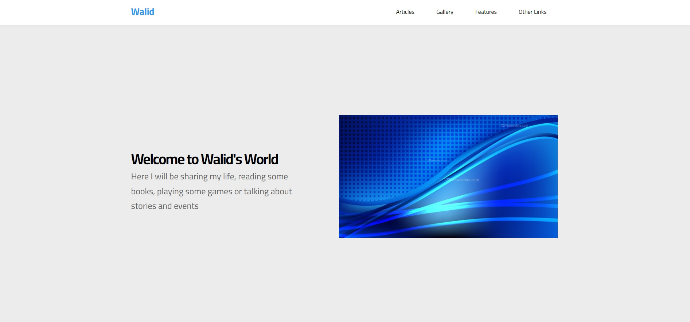
  - 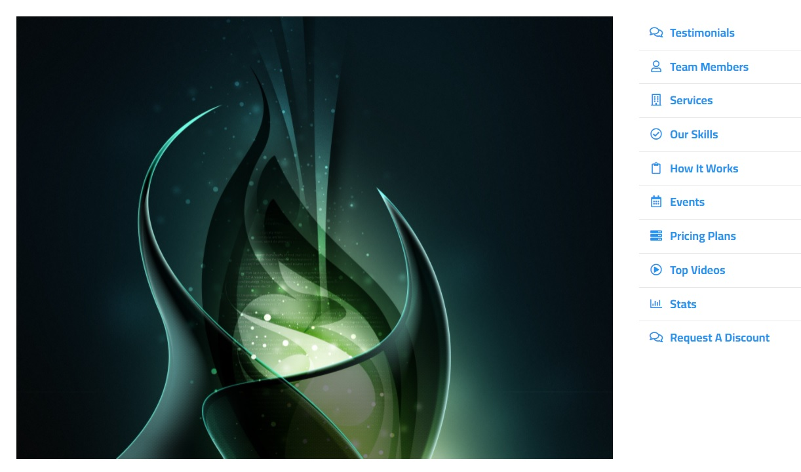
  - 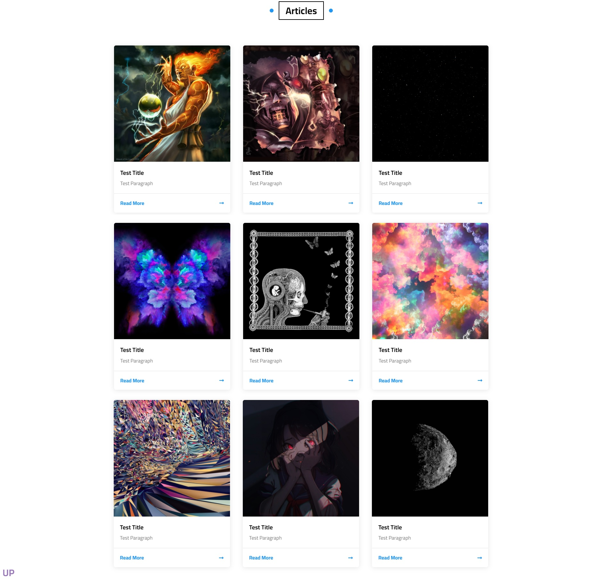
  - 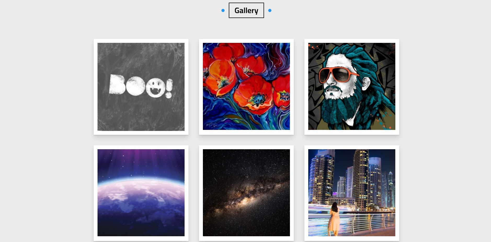
  - 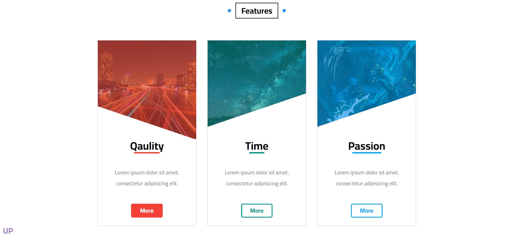
  - 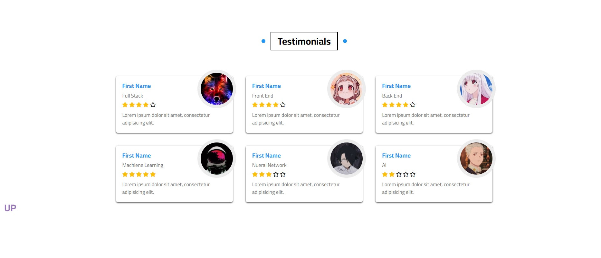
  - 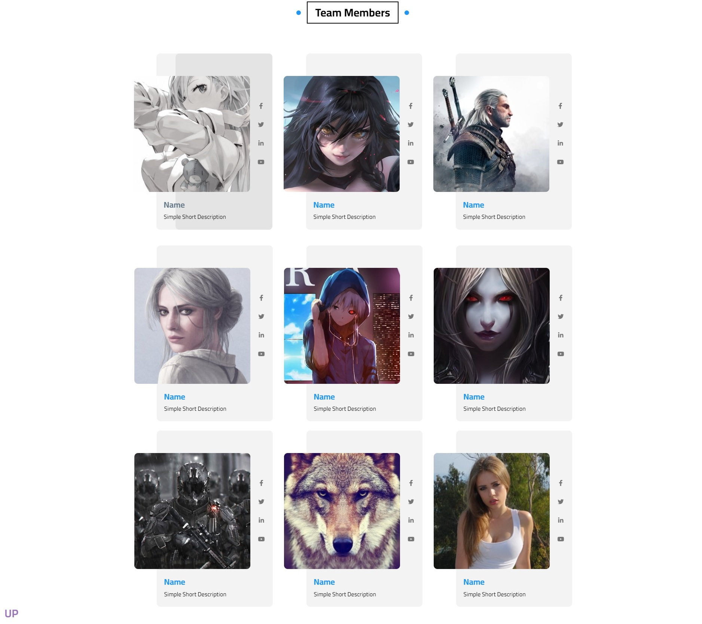
  - 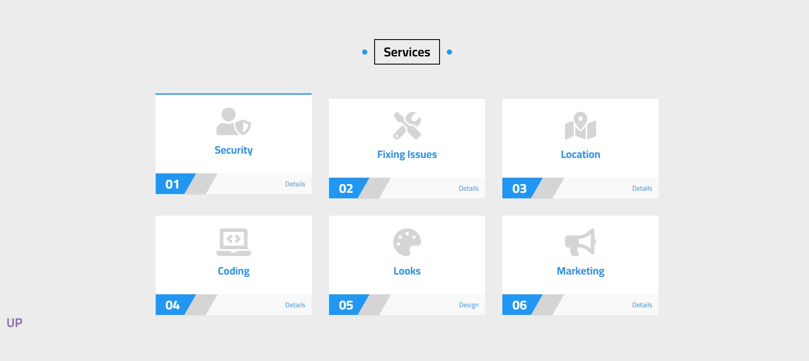
  - 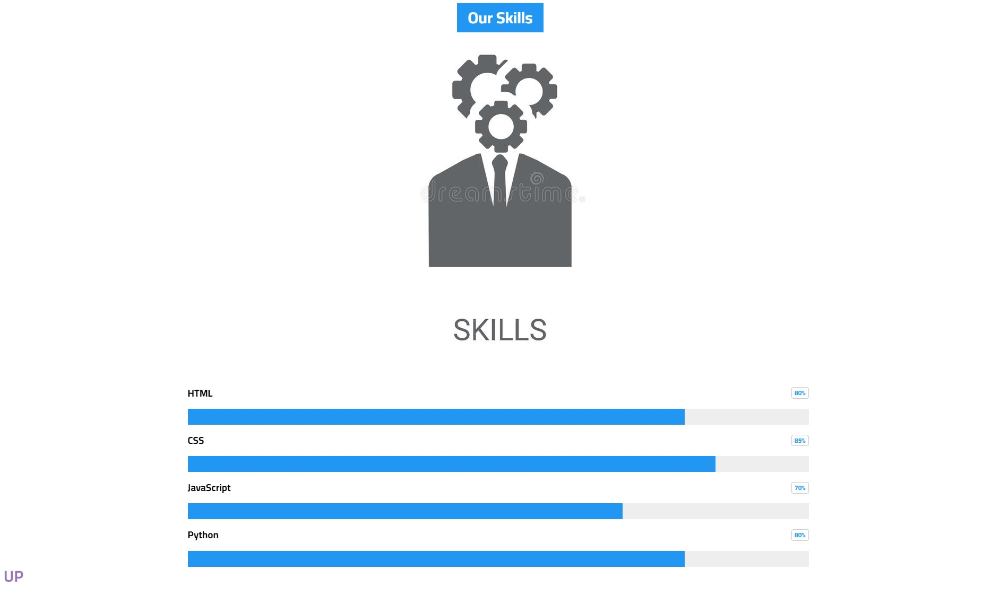
  - 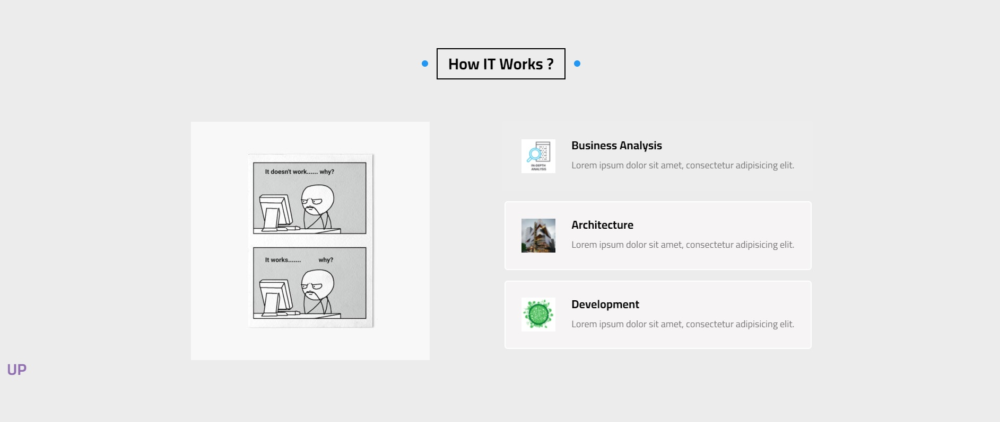
  - 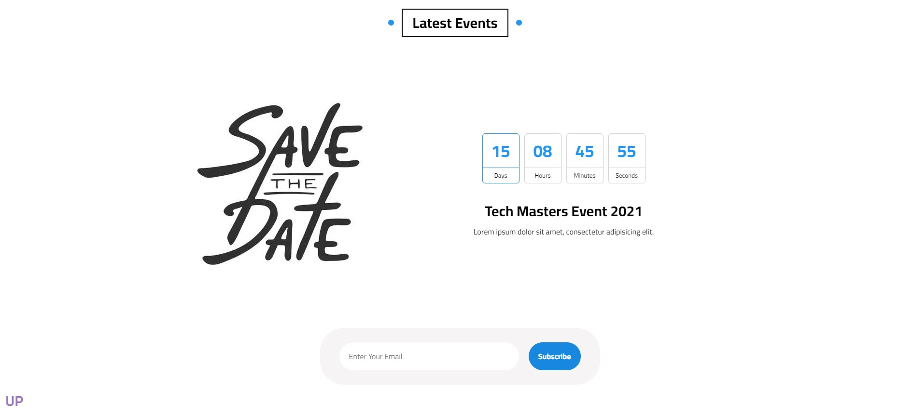
  - 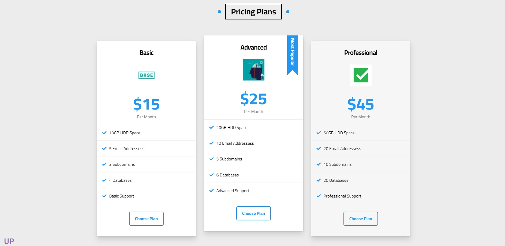
  - 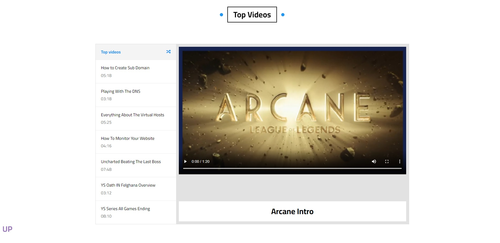
  - 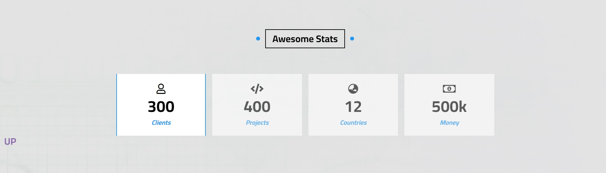
  - 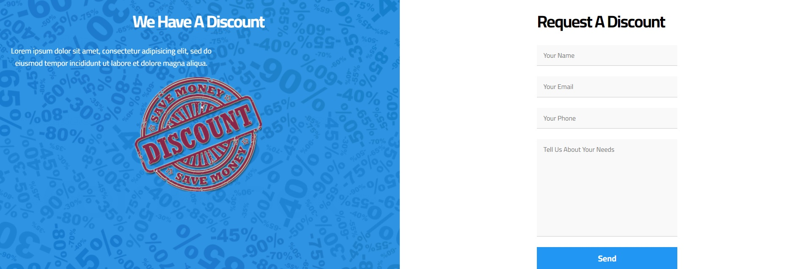
  - 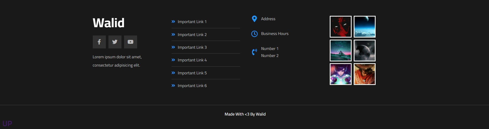

 - Users should be able to:
   - View the optimal layout for the site depending on their device's screen size
   - Hover Stats on many components
   - Animations on many components
   - Timings and switches on many components

 - What I Learned:
   - I am almost medium level after finishing this project seeing how massive it was with how fast I finished it
   - I was creative in many things from the page breaks to the animations to everything
   - I understood how to center everything or side step everything
   - I understood the button usages to go to a certain topic or go up to the main page
 
 - What I Couldn't Do:
   - Proud to say - Absolutely Nothing
